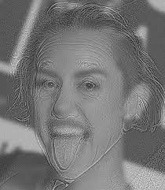

# Hybrid-Images

According to Wikipedia, a hybrid image is an image perceived in one of two different ways, depending on viewing distance, based on how humans process visual input.

Here are some examples:

    
    

    
    

    
    

 
 
As we can observe, the images look different at different distances. In the bigger image, we pay more attention to the details and high frequencies, and in the smaller image, we pay attention to low-frequency elements like colors.

So when we take low frequencies from one image, and we take high frequencies from the other one and combine them, we obtain a picture like that.
 
To work this out, we must transfer images to the frequency domain. The example we will work on is composed of these two images.
 

    
    

 
At first, we need to align these images. To do that, we use a **Transition+Scale** transformation. A good aligning point would be the eyes. So at the beginning of the program, it will ask you to click on the subject eyes in each image. After that, it will automatically generate the transformed results for you.
 
 
Here are the transformed images:
 
 

    
    

 
Now that we aligned images adequately, we get to the main section. We must convert these images to their frequency domain using **Discrete Fourier Transform**. One way to achieve the same result faster is using the **Fast Fourier Transform**. I used NumPy _ff2_ function to transfer images to the frequency domain, and I used fftshift to transfer the low frequencies to the center of the images. 
 
 
Here are the frequency domains of Harry and Voldemort!
 

    

        <h2 style="padding:20px; "> Harry </h2>
        
    

    

        <h2 style="padding:20px; "> Voldemort </h2>
        
    

The next step is to separate high frequencies from **Harry** and low frequencies from **Voldemort**. We use a Gaussian Filter to achieve a softer final result.
We need a Gaussian Low Pass Filter and a Gaussian High Pass Filter. If we present the standard derivation of low pass with $s$ and high pass with $r$, for this example, we used:
$$ s = 25 $$
$$ r = 35 $$

Low Pass:

$$
H(u, v) = e ^ {-\frac{D^2(u, v)}{2s^2}}
$$

High Pass:

$$
H(u, v) = 1 - e ^ {-\frac{D^2(u, v)}{2r^2}}
$$

Here are the results for Gaussian High Pass and Gaussian Low Pass mask:
 
 

<

If we apply these masks to them we acheive these results:
 

If we add them weighted, we use this equation for this example.
$$Hybird_f = 1.3 \times Harry_f + Voldemort_f$$

Here is the _Combined DFT_:

        

If we transfer back this result to _Spatial Domain_, we should get a good result. I used numpy _ifft_ for this part.

Since every image has three channels called **RGB**, I split the channels, performed the same operations, and finally merged them back together.

Here is the final merged result:

        

If we look at it in different distances we will see a diiferent person in it.
 

    
    

